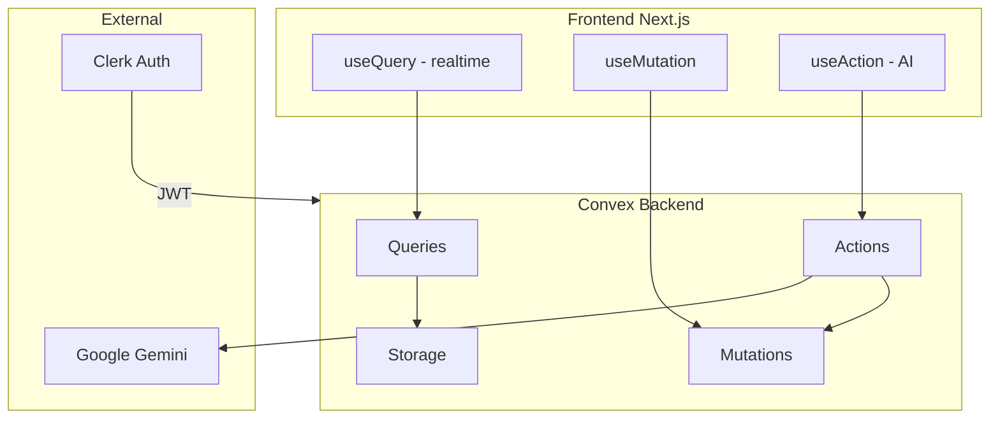

# Convex to Supabase Migration: Complexity and Viability Analysis

## Recommendation: Don't Migrate

**Stay on Convex** unless you have a strong, specific reason to move.

### Why Stay on Convex

1. **Realtime is central to your UX** – The app relies on `useQuery` subscriptions across ~15 components. Convex provides automatic live updates with zero configuration. Replacing this with Supabase means either rebuilding realtime from scratch (Postgres Changes) or accepting polling—both add significant complexity and effort.

2. **Convex fits your current design** – Your actions, mutations, and queries are already well-integrated. The AI flows (`processQuotes`, `processRenewal`, etc.) are long-running and call back into the DB—exactly what Convex Actions are built for. Supabase Edge Functions introduce timeout limits and a different mental model.

3. **Migration cost vs. benefit** – You'd be refactoring 17+ files, rewriting all data access patterns, porting 4 complex AI actions, and reimplementing auth, storage, and search. That's 2–4 weeks of work for no clear functional gain if the current stack is working.

4. **No stated pain points** – Without concrete problems (cost, SQL needs, self-hosting, etc.), migration is pure risk and effort.

### When Migration Would Make Sense

- You need SQL, complex queries, or existing Postgres tooling.
- You must self-host or run on-prem.
- Convex pricing becomes a problem at your scale.
- You're standardizing on Supabase/Postgres for other projects.

### Bottom Line

The app is well-suited to Convex today. Unless one of the above drivers applies, staying is the better choice.

---

## Current Architecture Summary

The app uses Convex for:

- **Database**: 5 tables (contacts, comparisons, documents, sessions, claims) with indexes and one search index
- **Realtime**: Automatic via `useQuery` subscriptions across ~15 components
- **Auth**: Clerk JWT validated by Convex; `userId` = `identity.subject`; admin via `publicMetadata.role`
- **File storage**: PDF/image uploads via `generateUploadUrl` → client POST → `addDocument`; actions fetch via `getUrl()`
- **Actions**: 4 long-running AI flows (processQuotes, processRenewal, processClaim, refineOutput) calling Google Gemini



---

## Feature-by-Feature Migration Mapping

| Convex Feature                | Supabase Equivalent                                 | Complexity      |
| ----------------------------- | --------------------------------------------------- | --------------- |
| Document DB + indexes         | PostgreSQL + tables/indexes                         | Low             |
| `useQuery` realtime           | Postgres Changes + `useSupabaseRealtime` or polling | **High**        |
| Clerk JWT auth                | Clerk third-party auth + RLS                        | Medium          |
| `generateUploadUrl` + storage | Supabase Storage (S3-compatible)                    | Medium          |
| Actions (Gemini AI)           | Edge Functions (Deno)                               | **Medium-High** |
| Search index (contacts)       | PostgreSQL `tsvector` full-text search              | Medium          |
| Admin role check              | RLS + JWT custom claim                              | Low             |

---

## 1. Database and Schema

**Complexity: Low**

- Convex schema maps cleanly to PostgreSQL.
- Convex `Id<"table">` becomes UUID or `bigint`; foreign keys need migration.
- Convex `_creationTime` becomes `created_at timestamptz`.
- JSONB for `result` and `extractedData` works well in Postgres.

**Migration**: Create tables, indexes, and RLS policies. No major blockers.

---

## 2. Realtime Subscriptions

**Complexity: High**

Convex `useQuery` gives:

- Automatic reactivity: UI updates when backend data changes
- No manual subscription setup
- Optimistic updates and caching

Supabase realtime:

- Opt-in Postgres Changes per table/channel
- Must subscribe explicitly and handle connection state
- Different API: `supabase.channel().on('postgres_changes', ...)`

**Impact**: Every `useQuery` call (~15+ usages) must be replaced with either:

- **Option A**: Supabase realtime subscriptions + local state (significant refactor)
- **Option B**: Polling via `useEffect` + `supabase.from().select()` (simpler, no realtime)
- **Option C**: React Query/SWR + Supabase client with manual refetch (common pattern)

**Recommendation**: Option C (React Query) is the most practical: similar DX, no realtime complexity. Realtime can be added later if needed.

---

## 3. Authentication (Clerk + Supabase)

**Complexity: Medium**

Clerk + Supabase is supported via [third-party auth](https://supabase.com/docs/guides/auth/third-party/clerk):

1. Configure Supabase to trust Clerk JWTs (JWKS).
2. Pass Clerk session token as Supabase `access_token`.
3. RLS policies use `auth.jwt()->>'sub'` for `userId`.

**Admin role**: Add `role` to Clerk session token and use in RLS:

```sql
-- Example: admin can see all, others only their data
CREATE POLICY "contacts_select" ON contacts
FOR SELECT USING (
  (auth.jwt()->>'role') = 'admin'
  OR (auth.jwt()->>'sub') = "userId"
);
```

**Migration**: New Supabase client setup, RLS for all tables, and Clerk JWT customization. Well-documented.

---

## 4. File Storage

**Complexity: Medium**

| Convex                   | Supabase                                                       |
| ------------------------ | -------------------------------------------------------------- |
| `generateUploadUrl()`    | `storage.from('bucket').createSignedUploadUrl()` or `upload()` |
| Client POST to URL       | Direct `storage.upload()` with file                            |
| `storageId` in documents | `storage_path` or object key                                   |
| `getUrl(id)`             | `getPublicUrl()` or `createSignedUrl()`                        |

**Migration**: Replace `components/file-upload.tsx` flow. Edge Functions need signed URLs or service role to read files for Gemini. Straightforward but requires new storage bucket and policies.

---

## 5. AI Actions (Critical Path)

**Complexity: Medium-High**

The 4 Convex actions (`processQuotes`, `processRenewal`, `processClaim`, `refineOutput`) are the most sensitive part.

**Supabase Edge Function limits**:

- Wall clock: 150s (free) / 400s (paid)
- Request idle: 150s before 504
- CPU: 2s per request (async I/O does not count)

**Typical duration** (from `convex/processQuotes.ts`):

- Upload files to Gemini: ~5–30s per file
- Poll until ACTIVE: up to 30s per file
- Extract + compare: ~20–60s
- **Total**: Often 60–180s for 2–3 documents

**Risk**: Free tier (150s) may hit timeouts for larger comparisons. Paid (400s) should be sufficient. Background tasks via `EdgeRuntime.waitUntil()` can help but add complexity.

**Migration**:

1. Move each action to a Supabase Edge Function (Deno).
2. Use Supabase client with **service role** to bypass RLS for internal updates (`updateStatus`, `storeResult`).
3. Fetch files from Supabase Storage via signed URLs or service role.
4. Keep Gemini logic; replace `ctx.runQuery`/`ctx.runMutation` with Supabase client calls.
5. Invoke from frontend via `supabase.functions.invoke('process-quotes', { body: { comparisonId, contactName } })`.

**Viability**: Yes, with paid plan for longer runs. Consider splitting into smaller steps if needed (e.g., extract → then compare in a second call).

---

## 6. Full-Text Search (Contacts)

**Complexity: Medium**

Convex `search_name` index → PostgreSQL full-text search:

- Add `tsvector` column to `contacts`.
- Trigger to keep it updated.
- Query with `to_tsvector` / `to_tsquery` or `textSearch()`.

Supabase supports this; implementation is standard Postgres.

---

## 7. Frontend Refactor Scope

**Files to modify**:

| File | Changes |
| ---- | ------- |
| `components/providers.tsx` | Replace ConvexProvider with Supabase client + Clerk |
| `app/(authenticated)/dashboard/page.tsx` | 3 useQuery → Supabase/React Query |
| `app/(authenticated)/comparison/new/page.tsx` | useMutation, useAction, useQuery |
| `app/(authenticated)/renewal/new/page.tsx` | Same |
| `app/(authenticated)/claims/new/page.tsx` | Same |
| `app/(authenticated)/comparison/[id]/page.tsx` | useQuery |
| `app/(authenticated)/renewal/[id]/page.tsx` | useQuery |
| `app/(authenticated)/claims/[id]/page.tsx` | useQuery |
| `app/(authenticated)/contacts/page.tsx` | useQuery + search |
| `app/(authenticated)/contacts/[id]/page.tsx` | useQuery |
| `app/(authenticated)/admin/page.tsx` | 3 useQuery |
| `components/file-upload.tsx` | generateUploadUrl, addDocument |
| `components/refine-chat.tsx` | useAction |
| `components/contact-selector.tsx` | useQuery + search |
| `components/add-contact-dialog.tsx` | useMutation |
| `components/document-row.tsx` | useMutation |
| `components/session-tracker.tsx` | useMutation |

**Estimated effort**: 2–4 weeks for an experienced developer, depending on realtime vs polling choice.

---

## 8. Viability Summary

| Aspect     | Viable?            | Notes                                                       |
| ---------- | ------------------ | ----------------------------------------------------------- |
| Database   | Yes                | Straightforward Postgres migration                          |
| Auth       | Yes                | Clerk + Supabase documented                                 |
| Storage    | Yes                | Different API, same capabilities                            |
| Search     | Yes                | Postgres full-text search                                   |
| AI Actions | Yes (with caveats) | Paid plan recommended; monitor timeouts                     |
| Realtime   | Partial            | Requires architectural choice (polling vs Postgres Changes) |
| Overall    | **Yes**            | Migration is feasible but non-trivial                       |

---

## 9. When to Migrate vs Stay on Convex

**Reasons to migrate to Supabase**:

- Need SQL, complex queries, or existing Postgres tooling
- Cost sensitivity (Supabase free tier can be cheaper at scale)
- Self-hosting or on-prem requirements
- Strong preference for PostgreSQL ecosystem

**Reasons to stay on Convex**:

- Realtime is central to UX and you want it without extra work
- Convex's TypeScript-native, action-based model fits the current design
- Team productivity and time-to-market matter more than backend flexibility
- Current stack is stable and meets needs

---

## 10. Recommended Migration Path (If Proceeding)

1. **Phase 1 – Foundation**: Supabase project, schema, RLS, Clerk integration, base client
2. **Phase 2 – CRUD**: Migrate contacts, comparisons, claims, documents, sessions to Supabase; add React Query
3. **Phase 3 – Storage**: Supabase Storage bucket, update file upload flow
4. **Phase 4 – Edge Functions**: Port each AI action; test under load for timeouts
5. **Phase 5 – Search**: Add full-text search for contacts
6. **Phase 6 – Cleanup**: Remove Convex, update env vars, final testing

**Data migration**: Export from Convex (or script), transform IDs and timestamps, import into Supabase.
